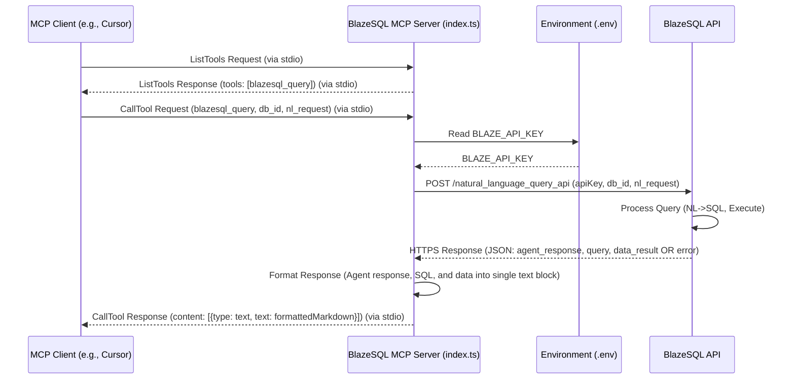

# BlazeSQL MCP Server

This project implements a Model Context Protocol (MCP) server using the `@modelcontextprotocol/sdk` that acts as a proxy to the BlazeSQL Natural Language Query API. It allows MCP-compatible clients (like Cursor, Claude 3 with tool use, the MCP Inspector, etc.) to interact with BlazeSQL using natural language.

## Features

*   Built using the modern `McpServer` helper class from the MCP SDK.
*   Exposes the BlazeSQL Natural Language Query API as an MCP tool named `blazesql_query`.
*   Uses `zod` for robust validation of tool input parameters.
*   Handles API key authentication securely via environment variables.
*   Communicates with clients using the standard MCP stdio transport.

## Workflow Diagram

This diagram shows the sequence of interactions when a client uses the `blazesql_query` tool (Note: The internal server logic now uses `McpServer` which simplifies tool registration compared to the low-level handlers shown in the diagram):



## Prerequisites

*   [Node.js](https://nodejs.org/) (LTS version recommended)
*   [Yarn](https://yarnpkg.com/) (Classic or Berry)
*   A BlazeSQL account with an API Key (Team Advanced subscription required for the API).
*   At least one database connection configured in your BlazeSQL account.
*   BlazeSQL Natural Language Query API Documentation: [https://help.blazesql.com/en/article/natural-language-query-api-1fgx4au/](https://help.blazesql.com/en/article/natural-language-query-api-1fgx4au/)

## Setup

1.  **Clone the Repository:**
    ```bash
    git clone <repository-url>
    cd blaze-sql-mcp-server
    ```

2.  **Install Dependencies:**
    ```bash
    yarn install
    ```
    This will install all necessary dependencies, including the `@modelcontextprotocol/sdk`, `dotenv`, and `zod`.

3.  **Configure Environment Variables:**
    *   Copy the example environment file:
        ```bash
        cp .env.sample .env
        ```
    *   Edit the `.env` file:
        ```dotenv
        # .env
        BLAZE_API_KEY=YOUR_BLAZESQL_API_KEY_HERE
        ```
        Replace `YOUR_BLAZESQL_API_KEY_HERE` with your actual API key obtained from your BlazeSQL account settings.

## Running the Server

1.  **Build the Server:**
    Compile the TypeScript code to JavaScript:
    ```bash
    yarn build
    ```

2.  **Run the Server:**
    Execute the compiled code:
    ```bash
    node build/index.js
    ```
    The server will start and log messages to `stderr` (you might see "API Key loaded successfully..." etc.). It is now listening for an MCP client connection via standard input/output (stdio).

## Connecting an MCP Client

This server uses the **stdio** transport mechanism.

### Using the MCP Inspector (Recommended for Testing)

1.  Make sure the server is **not** already running separately.
2.  Run the Inspector, telling it to launch your server:
    ```bash
    npx @modelcontextprotocol/inspector node build/index.js
    ```
3.  The Inspector UI will launch, automatically connecting to your server.
4.  Navigate to the "Tools" tab to interact with the `blazesql_query` tool.

### Using Integrated Clients (Cursor, Claude 3, etc.)

1.  **Start the server** in a terminal:
    ```bash
    node build/index.js
    ```
2.  **Configure the client:** In your MCP client's settings, you need to add a custom server configuration.
    *   **Transport:** Select `stdio`.
    *   **Command:** Specify the exact command used to run the server. You need to provide the **absolute path** to node and the **absolute path** to the `build/index.js` file.
        *   Example (macOS/Linux - adjust paths as needed):
            `/usr/local/bin/node /Users/your_username/path/to/blaze-sql-mcp-server/build/index.js`
        *   You can find the path to node using `which node` in your terminal.
        *   You can find the path to the project using `pwd` inside the project directory.
    *   Save the configuration.
3.  The client should now be able to connect to your locally running server and list/use its tools.

## Using the `blazesql_query` Tool

Once connected, the client can call the `blazesql_query` tool.

*   **Tool Name:** `blazesql_query`
*   **Arguments:**
    *   `db_id` (string, required): The ID of the target database connection in your BlazeSQL account. You can find this ID in the BlazeSQL web application when managing your database connections.
    *   `natural_language_request` (string, required): The query you want to execute, written in plain English (e.g., "show me the total number of users").
    *(Input is validated using `zod`)*

*   **Example Call (using `mcp test` syntax for illustration):**
    ```bash
    call-tool blazesql_query --db_id "db_your_actual_db_id" --natural_language_request "What were the total sales last month?"
    ```

*   **Output:**
    If successful, the tool returns a single `text` content block containing:
    *   The natural language response from the BlazeSQL agent.
    *   The generated SQL query within a Markdown code fence (```sql ... ```).
    *   The data results formatted as JSON within a Markdown code fence (```json ... ```).

    Example structure within the `text` block:
    ```markdown
    **Agent Response:**
    The total sales last month were $12345.67.

    **Generated SQL:**
    ```sql
    SELECT sum(sales_amount) FROM sales WHERE sale_date >= date('now', '-1 month');
    ```

    **Data Result (JSON):**
    ```json
    [
      {
        "sum(sales_amount)": 12345.67
      }
    ]
    ```
    ```

    If unsuccessful, it returns a `text` content block containing the error message from the BlazeSQL API and marks the response as an error (`isError: true`).
